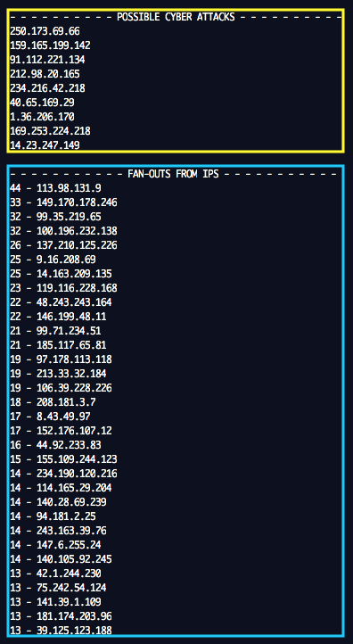

# cyber attacks

According to the FBI, cyber attacks through botnets have proliferated to the extent of causing great damage in all sectors.

One way of detecting this type of situation is through the collection of all the pertinent information that allows us to perform optimized searches for the timely detection of malicious access through robot networks.

